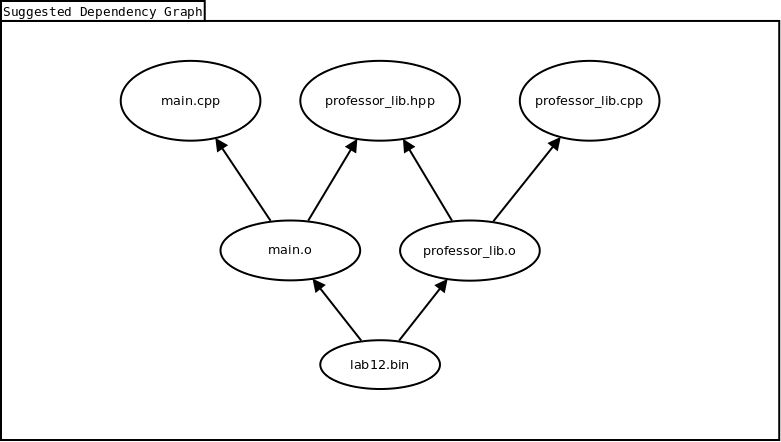
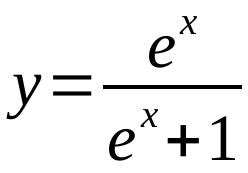

# CPSC 120-10 - Lab 12 - Instructions

This week we're finally practicing functions, as well as utilizing several source files in the same executable!

We'll get to implement several functions for this lab. For each function mentioned below, make sure you include its prototype at the top of your source code file.

*Please note*: When asked to print messages to the terminal, make sure you print all messages exactly as written or described in this assignment prompt. Typos can cause the auto-grader to fail, resulting in lost points. When in doubt, try copy+pasting output messages from this prompt to your code, instead of typing manually.

## Part 1 - Professor's Code Library

This lab comes seeded with a little code provided by your professor. This is both to help you visualize the result of your program, and to give you a little practice compiling and linking multiple source files into your executable program.

### Library Files

There are two library files to use when compiling+linking your executable:

|File             |Role                                          |
|--               |--                                            |
|professor_lib.hpp|C++ header file containing function prototypes|
|professor_lib.cpp|C++ file containing function definitions      |

#### Including the Header File

C++ header files (*hpp*) don't need to be compiled. You instead ```#include``` them from within *cpp* files.

First, you'll need to tell ```g++``` where to find the *professor_lib.hpp* file by telling it to search for C++ header files in your repository's root directory. You can add the switch ```-I``` to your ```g++``` command. The ```-I``` switch is followed (with no spaces) by a directory path (relative or absolute) to search for includes.

For example, a simple call to ```g++``` to include your repo's current directory while compiling *main.cpp* might look like the following:

```bash
$ g++ -Wall -pedantic -std=c++17 -g -I. -c main.cpp -o main.o
```

Some hints:

* Notice the ```-I.``` part

* You shouldn't hard-code the ```-I``` switch, but instead integrate it into the variable you're using for your other compilation flags.

* Notice we're using the ```-c``` flag, which compiles source code to an intermediate object file instead of directly to an executable.

This will allow you to include the library's header file in any *cpp* source file with a simple ```#include``` preprocessor directive, like so:

```cpp
#include "professor_lib.hpp"
```

*Hint*: Notice the use of quotes instead of < and >.

#### Compiling and Linking the CPP File

Now that we're using multiple *cpp* source files in the same program, each *cpp* source file needs to be compiled to a separate object code file. Then, each of those object files can be used as input to ```g++``` when linking your executable.

Here's an example of how we might compile your *main.cpp* file, along with the *professor_lib.cpp* file, then link them together into one executable:

```bash
$ g++ -Wall -pedantic -std=c++17 -g -I. -c main.cpp -o main.o
$ g++ -Wall -pedantic -std=c++17 -g -I. -c professor_lib.cpp -o professor_lib.o
$ g++ -Wall -pedantic -std=c++17 -g -I. main.o professor_lib.o -o lab12.bin
```

*Hint1*: Notice the ```-c``` flag isn't used when linking our executable

*Hint2*: Notice we sent every object file (ending in *.o*) as input when linking our executable

*Hint3*: You're expected to use the above commands inside your Makefile.

Of course this means that, since we're now separating the compilation and linking stages, you should end up with more Makefile targets. Now, your executable's Makefile target should depend not on the *cpp* source files, but on the *o* object files you generate during the compilation step. Also, each of those object files should get its own Makefile target, which in turn depends on the corresponding *cpp* source file.

#### Getting Dependencies Right

Also, don't forget! It's important each Makefile target have proper dependencies, so it knows when to rebuild itself. If you get dependencies wrong, object files may be built when they don't need to be, or they might ***not*** get built even when they do need to be built!

Here's a quick table showing which dependencies you should probably expect:

|Thing Being Built|Likely Dependencies                 |
|--               |--                                  |
|main.o           |main.cpp, professor_lib.hpp         |
|professor_lib.o  |professor_lib.cpp, professor_lib.hpp|
|Final executable |main.o, professor_lib.o             |

Notice how *main.cpp* depends on *professor_lib.hpp*. Why is that so? Here's a rundown as to why:

* Your *main.cpp* code will be using functions from the *professor_lib.cpp* file.

* *cpp* files containing function definitions don't typically ```#include``` each other, as they're meant to be compiled to separate object files, so we can't have *main.cpp* ```#include``` the *professor_lib.cpp* source file.

    * Remember ```#include``` would import the entire contents of one file into another


* Your *main.cpp* source file still needs to know about the signatures of the functions it's going to use from *professor_lib.cpp*

* The solution to this is that the file *professor_lib.hpp* contains all the prototypes (signatures plus a semicolon) from all functions inside the *professor_lib.cpp* source code file.

* Thus, any *cpp* source code file that needs to use some functions from *professor_lib.cpp* simply needs to ```#include``` the *professor_lib.hpp* file. This also applies to *professor_lib.cpp* itself!

* Thus, whenever *professor_lib.hpp* changes, any source files that utilizes it (e.g., *main.cpp*) should also be rebuilt.

You may also notice some strange preprocessor directives going on inside *professor_lib.hpp*. These are called [header guards](https://www.learncpp.com/cpp-tutorial/header-guards/) and help avoid compilation errors when the same header file is included with ```#include``` multiple times. You can read more about this issue [here](https://www.learncpp.com/cpp-tutorial/header-guards/).

#### Visual Dependency Graph

If you're a visual learner, you may find the following image helpful:



## Part 2 - A Function To Convert One Value

Let's write a function that converts one number into another, based on the following mathematical equation.



### Program Setup

We'll start by setting up our program as follows:

* Your program's Makefile target should be named *lab12*, and execute by default

* Your program's executable name should be: *lab12.bin*

* Your program's source file should be: *main.cpp*

### The Function

Create a function in your program called ```calculateSmoid```. This function should have one parameter named *x* of type ```double```. Your ```calculateSmoid``` function should return a ```double```.

Inside the function, use the *x* argument to compute the value of a new variable *y*. You'll need to rely on a mathematical constant ***e*** (explained below), as well as previous math skills you've practiced earlier this semester.

Once the value of *y* is computed, return it to the caller. In other words, the return value of your function should be the computed value of *y*, based on the received *x*.

#### The Value of the Constant e

The value of the constant ***e*** can be accessed with a simple trick:

1. Define the value *_USE_MATH_DEFINES* using the following pre-processor directive at the very top of your cpp source file:

    * ```#define _USE_MATH_DEFINES```

2. Include the *cmath* header (***after*** the ```#define``` directive)

3. The value of the constant ***e*** will then be available in your program as the symbol ```M_E```.

## Part 3 - A Function To Convert A Whole File

This next part should give you a small taste for how powerful functions can be when combined together through hierarchical calls.

Create another function in your program called ```convertFileToSmoid```. This function should return a ```bool``` and take four arguments:

1. An ```std::string``` named *source_file_name*, representing the desired name of a source file.

2. An ```std::string``` named *dest_file_name*, representing the desired name of a destination file.

3. An ```std::string``` named *message*, passed *by reference*, representing a message this function generates to describe the outcome of it's execution.

4. An integer named *record_count*, passed *by reference*, representing the total number of records converted.

The boolean return value will represent success or failure of the function as a whole. If any part of this function fails, the function should return ```false```. If the function wholly succeeds, it should return ```true```.

When this function is called, it should do the following:

1. Begin by setting the *message* variable to the string *OK*

2. Attempt to open the source file named by *source_file_name* for reading in text mode. If the file fails to open (or isn't present), set the *message* variable to the string *Unable to open input file*, and return failure.

3. Also open the destination file named by *dest_file_name* for writing, in text and truncate mode. If the file fails to open, set the *message* variable to the string *Unable to open output file*, and return failure.

4. For every number present in the source file, do the following:

    1. Assign the number to a variable.
    2. Convert the number with the ```calculateSmoid``` function.
    3. Write a new line to the destination file, containing the following:

        1. The original number
        2. A space
        3. The converted number

5. Close both files.

6. Set the variable *record_count* to the number of records your function has converted during this call.

You may find the following page useful for opening a file in truncate mode: [std::fstream::open](https://www.cplusplus.com/reference/fstream/fstream/open/)

## Part 4 - Receiving File Names From CLI Arguments

For this part, upgrade your ```main``` function to accept command line arguments. More specifically, your program will accept both the name of an input file, and the name of an output file.

A sample input file named *in.txt* has been provided with this repository and should be used as the input file.

You should use *out.txt* as the name of your output file, which will eventually be created by the functions you're writing this week.

You may wish to modify your Makefile target (or create an additional target) to pass the filename arguments to your program automatically, so you don't have to manually type them on the command line while testing your program.

Although the *in.txt* file is part of the repository, make sure *out.txt* is not tracked with git.

### If There Are Two CLI Arguments

Your program should check the count of command line arguments it receives. If there are two (in addition to the name of the executable) command line arguments, your program should:

1. Interpret the first argument as the name of an input file.

2. Interpret the the second as the name of an output file.

3. Print the message: *Begin file conversion of input file X to output file Y using calculateSmoid*.

    * Of course, X should be substituted for the name of the input file, and Y for the name of the output file (do not actually print X nor Y here).

4. Call the ```convertFileToSmoid``` function with those file names.

5. If the ```convertFileToSmoid``` function returns failure, print the message: *Failed to convert that file; Message was: MESSAGE* and exit the program with error code 1.

    * Hopefully you've guessed that *MESSAGE* should be replaced with the message set by the function.

6. If the ```convertFileToSmoid``` return success, print the message: *File conversion was successful; Converted X records; MESSAGE*, and exit the program with code 0.

    * Obviously *X* above would be replaced with the number of records converted.
    * And of course *MESSAGE* would be replaced with the message set by the function.

### For Any Other Number of CLI Arguments

For any other number of command line arguments, your program should complain *Invalid command line arguments!* and exit with an error code of 2.

## Part 5 - Visualizing Your Converted File

Now for the fun part. Your professor has written a few functions to help you visualize your converted data, and placed them in the extra library explained nearer the top of this document.

At the end of your ```main``` function, if-and-only-if your ```convertFileToSmoid``` function succeeded, you should call the professor's library function ```renderAndPrintConvertedFile``` with the name of your converted output file.

If you've successfully imported the professor's library into your *main.cpp* code (again, explained above), the ```renderAndPrintConvertedFile``` function should print a fun visualization of your data to the terminal. Try maximizing the terminal to the whole screen to see what it looks like.

Take a screenshot of this visualization and save it as *smoid.png* in your repository.


